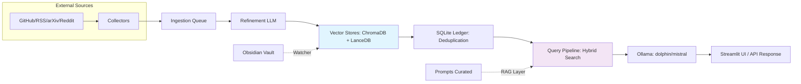

# llm-rag — Unified Local RAG + Intelligence OS + Obsidian Integration

[](https://github.com/ianmxaof/llm-rag-os)
[](https://github.com/ianmxaof/llm-rag-os)
[](LICENSE)

**⭐ Star this repo if local-first RAG + Obsidian sovereignty excites you—join the evolution!**

A modular local-first Retrieval-Augmented Generation (RAG) system integrating:

- **Multi-source automated knowledge ingestion** (GitHub, RSS, arXiv, Reddit, local files)
- **Local embeddings** (Ollama + fastembed)
- **Document + prompt vector stores** (ChromaDB + LanceDB)
- **Obsidian vault sync & ingestion** (Reference-class pipeline)
- **End-to-end refinement pipeline** (LLM-powered content enhancement)
- **FastAPI backend** (RESTful API)
- **Streamlit UI** (Web interface)
- **Multi-LLM chain** (embedding / refinement / chat)

This README provides complete setup instructions, including cloning, environment preparation, API keys, model setup, vector store initialization, ingestion operations, and how to run the full system.

---

## Table of Contents

1. [Features](#features)
2. [Architecture Overview](#architecture-overview)
3. [Prerequisites](#prerequisites)
4. [Installation](#installation)
5. [Environment Variables & API Keys](#environment-variables--api-keys)
6. [Model Setup (Ollama)](#model-setup-ollama)
7. [Running the System](#running-the-system)
8. [Folder Structure](#folder-structure)
9. [Using the RAG System](#using-the-rag-system)
10. [Ingestion Pipelines](#ingestion-pipelines)
11. [Obsidian Integration](#obsidian-integration)
12. [Prompt RAG (Prompt Intelligence Layer)](#prompt-rag-prompt-intelligence-layer)
13. [Intelligence OS Components](#intelligence-os-components)
14. [Troubleshooting](#troubleshooting)

---

## Features

### ✔ Local Embeddings, Chat, and Refinement

Uses **Ollama** for a multi-stage LLM chain:

| Stage | Model/Example | Purpose |
|-------|---------------|---------|
| **Embedding** | `nomic-embed-text` (Ollama/fastembed) | Vectorize chunks (384-dim, multilingual) |
| **Refinement** | `llama3.1` (Ollama) or Anthropic/OpenAI | Summarize/enhance content pre-storage |
| **Chat/Generation** | `mistral:7b-instruct-q5_K_M` (Ollama) | Final uncensored response generation |

**fastembed** integration for 3-6x faster embeddings (optional, recommended)

### ✔ Multi-Source Ingestion

Pulls content from:
- **GitHub** (repositories, issues, discussions)
- **RSS feeds** (blogs, news, updates)
- **arXiv** (research papers)
- **Reddit** (subreddits, discussions)
- **Local file drops** (PDFs, markdown, text files)
- **Obsidian vault** (watch folders with automatic sync)

### ✔ Vector Database Stack

- **ChromaDB** — documents (primary vector store; excels at simple, high-volume semantic search)
- **LanceDB** — prompts + Obsidian notes (hybrid BM25+vector search via Tantivy FTS; ideal for metadata-rich, structured content like YAML frontmatter and prompt categories—3-5x denser storage, faster cold queries)
- **SQLite** — ingestion ledger (deduplication)

### ✔ Automated Pre-Pipeline

- Preprocessing (text extraction, normalization)
- Chunking (semantic heading-based chunking)
- Embedding (Ollama or fastembed)
- Deduplication (SQLite ledger)
- Refinement (LLM-powered content enhancement)
- Secret scanning (TruffleHog integration)

### ✔ Frontend / Backend

- **FastAPI REST API** (comprehensive endpoints)
- **Streamlit UI** (beautiful web interface)

### ✔ Reference-Class Obsidian Integration

- Metadata-aware chunking by headings
- YAML frontmatter extraction with graceful fallback
- SQLite ingestion ledger for 100% correct deduplication
- Pre-computed chunk summaries via Ollama
- obsidian:// deep link generation
- Separate curated/raw collections

---

## Architecture Overview

```
External Sources → Collectors → Ingestion Queue → Refinement → Vector Stores → Query Pipeline → LLM Response
```

**Data Plane:** Collectors (GitHub, RSS, arXiv, Reddit) → Ingestion pipeline (preprocess → chunk → embed → store) → Vector stores (ChromaDB, LanceDB) → SQLite ledger (deduplication)

**Control Plane:** FastAPI backend (orchestration) → Queue management → Refinement service → Secret scanning (TruffleHog)

**Infrastructure Plane:** Ollama (local LLM) → Streamlit UI → File watchers (Obsidian, inbox)



---

## Prerequisites

### System Requirements

- **Python 3.10+**
- **Git**
- **Pip + venv**
- **8–16 GB RAM** recommended for local models
- **Obsidian** (optional, for vault integration)

### Software Requirements

| Required | Purpose |
|----------|---------|
| Ollama | Embeddings + local LLM chat |
| Python 3.10+ | Runtime |
| ChromaDB | Document store |
| LanceDB | Prompt + Obsidian storage (optional) |
| SQLite3 | Ledger (built-in Python) |

---

## Installation

### 1. Clone the Repository

```bash
git clone https://github.com/ianmxaof/llm-rag-os.git
cd llm-rag-os
```

### 2. Create a Python Virtual Environment

```bash
python -m venv venv

# macOS/Linux
source venv/bin/activate

# Windows
venv\Scripts\activate
```

### 3. Install Python Dependencies

```bash
pip install --upgrade pip
pip install -r requirements.txt

# Optional: Install Obsidian RAG dependencies
pip install -r requirements-obsidian.txt
```

### 4. Install TruffleHog (Optional but Recommended)

```bash
pip install trufflehog
```

---

## Environment Variables & API Keys

Create a `.env` file in the root:

```bash
# --- Optional External APIs ---
GITHUB_TOKEN=<pat>              # For collectors + crawling
REDDIT_CLIENT_ID=<id>
REDDIT_SECRET=<secret>
REDDIT_USER_AGENT=llmrag/1.0
ARXIV_EMAIL=<your-email>
HF_API_KEY=<huggingface-key>

# --- LLM Providers (optional if not using external refinement) ---
ANTHROPIC_API_KEY=<anthropic-key>
OPENAI_API_KEY=<openai-key>

# --- Local paths ---
OBSIDIAN_VAULT_PATH=/absolute/path/to/ObsidianVault
WATCH_FOLDER_MANUAL=./watch/Manual
WATCH_FOLDER_AUTO=./watch/Auto

# --- Ollama settings (optional, defaults provided) ---
OLLAMA_API_BASE=http://localhost:11434/api
OLLAMA_EMBED_MODEL=nomic-embed-text
OLLAMA_CHAT_MODEL=mistral:7b-instruct-q5_K_M

# --- Embedding settings (optional) ---
EMBED_MODEL_NAME=BAAI/bge-small-en-v1.5
CHUNK_SIZE=1500
CHUNK_OVERLAP=200

# --- Vector store (optional) ---
COLLECTION_NAME=llm_docs
```

**Where to get the keys:**

| Service | Where to generate keys |
|---------|------------------------|
| GitHub PAT | GitHub → Settings → Developer Settings → Personal Access Tokens |
| Reddit API | https://www.reddit.com/prefs/apps |
| HuggingFace API Key | https://huggingface.co/settings/tokens |
| Anthropic | https://console.anthropic.com |
| OpenAI | https://platform.openai.com/api-keys |

---

## Model Setup (Ollama)

### Install Ollama

Download and install from: https://ollama.com/download

### Pull Required Models

```bash
# Required for embeddings
ollama pull nomic-embed-text

# Required for chat
ollama pull mistral

# Optional: For refinement
ollama pull llama3.1:latest
```

(If you use Anthropic or OpenAI for refinement instead of local refinement, skip refinement model pulls.)

---

## Running the System

### 1. Start the FastAPI Backend

```bash
# Windows
scripts\run_backend.bat

# Linux/macOS
./scripts/run_backend.sh

# Or manually
uvicorn backend.app:app --reload --port 8000
```

### 2. Start the Streamlit UI

```bash
streamlit run src/app/streamlit_app.py
```

UI should launch at: **http://localhost:8501**

### 3. (Optional) Start File Watchers

```bash
# Start Obsidian watcher
python scripts/obsidian_rag_ingester.py

# Start inbox watcher
python scripts/watch_and_ingest.py
```

---

## Deployment (Docker)

Docker deployment is **recommended for production** and provides an isolated, reproducible environment. The system runs as a single container with all services orchestrated together.

### Quick Start

**One-command deployment:**

```bash
docker-compose up -d
```

This spins up the complete stack:
- **Ollama** (local LLM inference) - Port `11434`
- **FastAPI backend** (REST API) - Port `8000`
- **Streamlit UI** (Web interface) - Port `8501`

Access the services:
- **Streamlit UI**: http://localhost:8501
- **FastAPI Docs**: http://localhost:8000/docs
- **Ollama API**: http://localhost:11434/api

### Docker Compose Configuration

The `docker-compose.yml` includes:

**Services:**
- Single `rag` service with all components
- Auto-restart on failure (`restart: unless-stopped`)
- Health checks and proper service dependencies

**Volume Mounts (Persistent Data):**
- `./knowledge` → `/app/knowledge` (inbox, processed files, Obsidian vault)
- `./chroma` → `/app/chroma` (ChromaDB vector store)
- `./data` → `/app/data` (LanceDB, SQLite ledger, other data)

**Port Mappings:**
- `8501:8501` - Streamlit UI
- `8000:8000` - FastAPI backend
- `11434:11434` - Ollama API

**Environment Variables:**
- `OLLAMA_API_BASE` - Ollama API endpoint
- `OLLAMA_EMBED_MODEL` - Embedding model name
- `OLLAMA_CHAT_MODEL` - Chat model name

### Customization

**Override environment variables:**

Create a `.env` file (see [Environment Variables & API Keys](#environment-variables--api-keys)):

```bash
# .env
OLLAMA_EMBED_MODEL=nomic-embed-text
OLLAMA_CHAT_MODEL=mistral:7b-instruct-q5_K_M
GITHUB_TOKEN=your_token_here
```

Docker Compose automatically loads `.env` files.

**Custom port mapping:**

Edit `docker-compose.yml`:

```yaml
ports:
  - "8502:8501"  # Streamlit on custom port
  - "8001:8000"  # FastAPI on custom port
```

**Add additional volumes:**

```yaml
volumes:
  - ./knowledge:/app/knowledge
  - ./chroma:/app/chroma
  - ./data:/app/data
  - ./prompts:/app/prompts  # Add prompts directory
```

### Building Custom Images

**Build from Dockerfile:**

```bash
docker build -t llm-rag-os:latest .
```

**Build with custom tag:**

```bash
docker build -t llm-rag-os:v0.2 .
```

**Build with build arguments:**

```bash
docker build \
  --build-arg PYTHON_VERSION=3.11 \
  --build-arg INSTALL_OBSIDIAN_DEPS=true \
  -t llm-rag-os:custom .
```

### Development vs Production

**Development (with hot reload):**

```bash
# Mount source code for live editing
docker-compose -f docker-compose.dev.yml up
```

**Production (optimized):**

```bash
# Use pre-built image, no source mounts
docker-compose up -d
```

### Docker Commands Reference

**Start services:**
```bash
docker-compose up -d          # Start in background
docker-compose up              # Start with logs
```

**Stop services:**
```bash
docker-compose stop            # Stop services
docker-compose down             # Stop and remove containers
docker-compose down -v          # Stop and remove volumes (⚠️ deletes data)
```

**View logs:**
```bash
docker-compose logs -f         # Follow all logs
docker-compose logs rag         # Service-specific logs
```

**Execute commands in container:**
```bash
docker-compose exec rag bash                    # Open shell
docker-compose exec rag python scripts/ingest.py  # Run ingestion
docker-compose exec rag ollama list              # List Ollama models
```

**Pull models in container:**
```bash
docker-compose exec rag ollama pull nomic-embed-text
docker-compose exec rag ollama pull mistral
```

### Multi-Container Setup (Advanced)

For production deployments, you can split services:

**Option 1: Separate Ollama service**

```yaml
services:
  ollama:
    image: ollama/ollama:latest
    volumes:
      - ollama-models:/root/.ollama
    ports:
      - "11434:11434"
  
  rag-backend:
    build: .
    depends_on:
      - ollama
    environment:
      - OLLAMA_API_BASE=http://ollama:11434/api
```

**Option 2: External Ollama**

If Ollama runs on the host:

```yaml
services:
  rag:
    build: .
    extra_hosts:
      - "host.docker.internal:host-gateway"
    environment:
      - OLLAMA_API_BASE=http://host.docker.internal:11434/api
```

### Troubleshooting Docker

**Container won't start:**
```bash
# Check logs
docker-compose logs rag

# Check container status
docker-compose ps

# Restart services
docker-compose restart
```

**Port already in use:**
```bash
# Find process using port
# Windows
netstat -ano | findstr :8000

# Linux/macOS
lsof -i :8000

# Change ports in docker-compose.yml
```

**Volume permissions:**
```bash
# Fix permissions (Linux/macOS)
sudo chown -R $USER:$USER knowledge/ chroma/ data/

# Or run container with user mapping
docker-compose run --user $(id -u):$(id -g) rag bash
```

**Ollama models not persisting:**
- Models are stored in container by default
- Mount Ollama data directory: `- ./ollama-data:/root/.ollama`

**Out of disk space:**
```bash
# Clean up Docker
docker system prune -a

# Remove unused volumes
docker volume prune
```

### Production Deployment Checklist

- [ ] Set strong passwords/API keys in `.env`
- [ ] Configure volume backups for `knowledge/`, `chroma/`, `data/`
- [ ] Set up health checks and monitoring
- [ ] Configure reverse proxy (nginx/traefik) for HTTPS
- [ ] Set resource limits (CPU/memory) in docker-compose.yml
- [ ] Enable log rotation
- [ ] Pull required Ollama models before deployment
- [ ] Test volume persistence across container restarts

### Docker Compose Examples

**Minimal setup (testing):**
```bash
docker-compose -f docker/intelligence-minimal.yml up
```

**Full stack with all features:**
```bash
docker-compose up -d
```

**Development with source mounts:**
```bash
docker-compose -f docker-compose.dev.yml up
```

---

## Folder Structure

```
llm-rag-os/
│
├── backend/                    # FastAPI backend
│   ├── app.py                 # FastAPI application
│   ├── models.py              # Database models
│   ├── controllers/          # API route handlers
│   │   ├── ollama.py         # Ollama integration
│   │   ├── ingest.py         # Ingestion endpoints
│   │   ├── prompts.py        # Prompt RAG endpoints
│   │   ├── alerts.py         # Alert system
│   │   ├── queue.py          # Queue management
│   │   └── ...
│   ├── collectors/           # External source collectors
│   │   ├── github.py
│   │   ├── rss.py
│   │   ├── arxiv.py
│   │   └── reddit.py
│   └── services/             # Background services
│       ├── ingestion_queue.py
│       ├── refinement.py
│       ├── scheduler.py
│       └── secret_scanner.py
│
├── scripts/                   # Utility scripts
│   ├── obsidian_rag_ingester.py    # Obsidian watch-folder pipeline
│   ├── obsidian_metadata.py        # YAML extraction
│   ├── obsidian_chunker.py         # Heading-based chunking
│   ├── obsidian_ledger.py          # SQLite deduplication
│   ├── obsidian_api.py              # FastAPI reindex endpoint
│   ├── prompt_ingester.py           # Prompt ingestion
│   ├── seed_prompt_corpus.py        # Seed prompt corpus
│   ├── intelligence_pipeline.py     # Intelligence OS pipeline
│   ├── embed_worker.py              # Background embedding worker
│   ├── ingest.py                    # Main ingestion script
│   ├── watch_and_ingest.py          # Inbox watcher
│   └── config.py                     # Configuration
│
├── src/                       # Client utilities
│   ├── app/
│   │   └── streamlit_app.py  # Streamlit GUI
│   ├── prompt_rag.py         # Prompt RAG retrieval
│   ├── api_client.py         # FastAPI client
│   └── rag_utils.py          # RAG utilities
│
├── config/                    # Configuration files
│   ├── obsidian-templates/   # Obsidian templates (version-controlled)
│   └── quickadd-macros.json  # QuickAdd configuration
│
├── knowledge/                 # Knowledge base (gitignored)
│   ├── inbox/                # Drop files here
│   ├── notes/                # Obsidian vault (gitignored)
│   │   ├── Manual/          # Manual notes
│   │   ├── Auto/            # Auto-ingested notes
│   │   └── _templates/      # Obsidian templates
│   ├── processed/           # Processed files
│   └── archived/            # Archived files
│
├── chroma/                    # ChromaDB data (gitignored)
├── data/                      # Data directory (gitignored)
│   ├── lancedb_obsidian/     # LanceDB Obsidian collection
│   ├── tantivy_obsidian/     # Tantivy full-text index
│   └── obsidian_ingestion_ledger.db  # SQLite ledger
│
├── prompts/                   # Prompt corpus (gitignored)
│
├── tests/                     # Test suite
│   └── ...
│
├── docker/                    # Docker configurations
│   └── intelligence-minimal.yml
│
├── Dockerfile                 # Docker configuration
├── docker-compose.yml         # Docker Compose config
├── requirements.txt           # Python dependencies
├── requirements-obsidian.txt # Obsidian RAG dependencies
├── README.md                  # This file
├── OBSIDIAN_RAG_IMPLEMENTATION_SUMMARY.md
├── PROMPT_RAG_README.md
├── INTELLIGENCE_OS_README.md
└── .gitignore                 # Git ignore rules
```

---

## Using the RAG System

### Adding Documents

**Option 1: Drop files in inbox**
```bash
# Place PDFs/Markdown in:
./knowledge/inbox/
```

**Option 2: Point ingestion pipeline to a folder**
```bash
python scripts/ingest.py --src ./data --no-reset
```

**Option 3: Use Streamlit UI**
- Open Streamlit → Ingest tab
- Click "Embed Now (Load → Embed → Unload)"

### Running a User Query

**Through Streamlit UI:**
- Navigate to "Ask a Question" tab
- Enter your query
- View results with source citations

**Via API:**
```bash
curl -X POST http://localhost:8000/query \
     -H "Content-Type: application/json" \
     -d '{"query": "How does my pipeline handle Obsidian?"}'
```

**Via Python:**
```python
import requests

response = requests.post(
    "http://localhost:8000/query",
    json={"query": "Explain the Obsidian integration"}
)
print(response.json())
```

---

## Ingestion Pipelines

### Automatic Ingestion

The ingestion pipeline includes:

1. **Deduplication** (SQLite ledger)
2. **Preprocessing** (markdown, text extraction)
3. **Chunking** (semantic heading-based)
4. **Embedding** (Ollama or fastembed)
5. **Storing** in ChromaDB

### Run Ingestion

```bash
# Single file
python scripts/ingest.py --src knowledge/inbox/file.md

# Batch ingestion
python scripts/ingest.py --src knowledge/inbox --parallel

# Watch mode (continuous)
python scripts/watch_and_ingest.py
```

### API Endpoints

```bash
# Ingest single file
curl -X POST "http://localhost:8000/ingest/file" \
     -H "Content-Type: application/json" \
     -d '{"path": "knowledge/inbox/myfile.md"}'

# Run batch ingestion
curl -X POST "http://localhost:8000/ingest/run?path=knowledge/inbox&fast=true&parallel=true"
```

---

## Obsidian Integration

### Setup

1. **Configure `.env`:**
```bash
OBSIDIAN_VAULT_PATH=/path/to/your/vault
```

2. **Start the watcher:**
```bash
python scripts/obsidian_rag_ingester.py
```

### Features

The Obsidian watcher automatically:
- Detects file changes in `knowledge/notes/Manual/` and `knowledge/notes/Auto/`
- Extracts YAML frontmatter (with graceful fallback)
- Chunks content by headings (H1-H6) with 150-char overlap
- Checks SQLite ledger for deduplication
- Pre-computes chunk summaries via Ollama (optional)
- Embeds with fastembed (3-6x faster)
- Stores in LanceDB with obsidian:// deep links
- Separates curated vs raw collections

### Force Reindex

```bash
# Via FastAPI endpoint
curl -X POST "http://localhost:8001/reindex?file=Manual/MyNote.md"

# Or start the API server
python scripts/obsidian_api.py
```

### Documentation

**📚 Detailed Documentation:**
- [Obsidian RAG Implementation Summary](OBSIDIAN_RAG_IMPLEMENTATION_SUMMARY.md) - Complete technical details
- [Obsidian RAG README](scripts/OBSIDIAN_RAG_README.md) - Usage guide and API reference

---

## Prompt RAG (Prompt Intelligence Layer)

### Overview

The Prompt RAG Layer provides an elite prompt repository with:
- Prompt ingestion from GitHub/HF repos
- Extraction + scoring
- Embedding / indexing in LanceDB
- Hybrid retrieval on every query
- System-prompt augmentation

### Run Prompt Ingestion

```bash
# Ingest prompts from a repository
python scripts/prompt_ingester.py --source github --repo microsoft/guidance

# Seed initial corpus
python scripts/seed_prompt_corpus.py
```

### Use Prompt RAG

```python
from src.prompt_rag import retrieve_prompts

# Retrieve relevant prompts for a query
prompts = retrieve_prompts("improve logging", top_k=3)
for prompt in prompts:
    print(f"Score: {prompt['score']}")
    print(f"Content: {prompt['content'][:200]}...")
```

### API Endpoints

```bash
# Retrieve prompts
curl -X GET "http://localhost:8000/prompts/retrieve?query=improve+logging&top_k=3"
```

### Documentation

**📚 Detailed Documentation:**
- [Prompt RAG README](PROMPT_RAG_README.md) - Complete guide and API reference
- [Prompt RAG Implementation Summary](PROMPT_RAG_IMPLEMENTATION_SUMMARY.md) - Technical architecture

---

## Intelligence OS Components

### Collectors

Fetch external knowledge using scheduled or on-demand collectors:

```bash
# GitHub collector
python backend/collectors/github.py --repo microsoft/guidance --limit 10

# RSS collector
python backend/collectors/rss.py --feed https://example.com/feed.xml

# Reddit collector
python backend/collectors/reddit.py --subreddit machinelearning --limit 20

# arXiv collector
python backend/collectors/arxiv.py --query "large language models" --max_results 10
```

### Secret Scanning

Runs TruffleHog against incoming content:

```bash
python backend/services/secret_scanner.py --path knowledge/inbox
```

### Refinement Service

Uses LLM to clean, summarize, and normalize content:

```bash
python backend/services/refinement.py --file knowledge/inbox/file.md
```

### Queue Management

```bash
# View queue status
curl http://localhost:8000/queue/status

# Add to queue
curl -X POST "http://localhost:8000/queue/add" \
     -H "Content-Type: application/json" \
     -d '{"source": "github", "params": {"repo": "microsoft/guidance"}}'
```

### Documentation

**📚 Detailed Documentation:**
- [Intelligence OS README](INTELLIGENCE_OS_README.md) - Complete guide and collector documentation
- [Intelligence OS Implementation Summary](INTELLIGENCE_OS_IMPLEMENTATION.md) - Technical architecture

---

## Troubleshooting

### Ollama Model Not Found

```bash
# Pull required models
ollama pull mistral
ollama pull nomic-embed-text
```

### Ollama Not Responding

```bash
# Check if Ollama is running
curl http://localhost:11434/api/tags

# Restart Ollama
ollama serve
```

### ChromaDB "Cannot Write File"

```bash
# Delete lockfiles
rm -rf chroma/*.lock

# Or on Windows
Remove-Item chroma\*.lock -Force
```

### LanceDB Permission Error

```bash
# Ensure directory is writable
chmod -R 755 data/lancedb_obsidian

# Or on Windows, check folder permissions
```

### Obsidian Not Ingesting

1. Check `.env` has `OBSIDIAN_VAULT_PATH` set correctly
2. Verify watcher is running: `python scripts/obsidian_rag_ingester.py`
3. Check logs for errors
4. Verify files are in `knowledge/notes/Manual/` or `knowledge/notes/Auto/`

### Port Already in Use

Change ports in:
- `scripts/run_backend.bat` / `scripts/run_backend.sh` (FastAPI)
- `src/app/streamlit_app.py` (Streamlit)
- `scripts/obsidian_api.py` (Obsidian reindex API, default: 8001)

### Import Errors

```bash
# Ensure all dependencies are installed
pip install -r requirements.txt
pip install -r requirements-obsidian.txt

# Verify Python version
python --version  # Should be 3.10+
```

---

## API Documentation

Once the backend is running, visit:
- **Swagger UI**: http://localhost:8000/docs
- **ReDoc**: http://localhost:8000/redoc

### Key Endpoints

| Endpoint | Method | Description |
|----------|--------|-------------|
| `/health` | GET | Health check |
| `/ollama/status` | GET | Ollama service status |
| `/ollama/embed` | POST | Embed texts |
| `/ingest/file` | POST | Ingest single file |
| `/ingest/run` | POST | Run batch ingestion |
| `/library/list` | GET | List documents |
| `/query` | POST | Query RAG system |
| `/prompts/retrieve` | GET | Retrieve prompts (Prompt RAG) |
| `/queue/status` | GET | Queue status |
| `/reindex` | POST | Force reindex Obsidian note |

---

## Development

### Running Tests

```bash
# Run Obsidian integration tests
python scripts/test_obsidian_integration.py

# Run smoke tests
python tests/smoke_test.py

# Or with pytest
pytest tests/
```

### CI/CD

GitHub Actions automatically runs smoke tests on version tags:

```bash
git tag -a v0.2 -m "Release with Obsidian RAG"
git push origin v0.2
```

---

## Roadmap

- [x] Ollama integration with auto-unload
- [x] Single-file ingestion
- [x] Docker support
- [x] CI/CD pipeline
- [x] Obsidian integration (Reference-class)
- [x] Prompt RAG Layer
- [x] Intelligence OS (collectors, refinement, scanning)
- [ ] Graph visualization (Obsidian-style)
- [ ] Plugin system
- [ ] Hybrid BM25+vector search integration (tantivy)
- [ ] Two-way Obsidian sync (Local REST API)

---

## Contributing

Contributions welcome! Please:

1. Fork the repository
2. Create a feature branch (`git checkout -b feature/amazing-feature`)
3. Make your changes
4. Add tests
5. Commit your changes (`git commit -m 'Add amazing feature'`)
6. Push to the branch (`git push origin feature/amazing-feature`)
7. Open a Pull Request

---

## License

MIT License - see LICENSE file for details

---

## Acknowledgments

- [Ollama](https://ollama.com) for local LLM inference
- [ChromaDB](https://www.trychroma.com/) for vector storage
- [LanceDB](https://lancedb.github.io/lancedb/) for prompt + Obsidian storage
- [fastembed](https://github.com/qdrant/fastembed) for fast embeddings
- [FastAPI](https://fastapi.tiangolo.com/) for the API framework
- [Streamlit](https://streamlit.io/) for the GUI
- [TruffleHog](https://github.com/trufflesecurity/trufflehog) for secret scanning

---

## Version

**v0.2** - Release with Obsidian RAG Pipeline, Prompt RAG Layer, and Intelligence OS

---

**Built with ❤️ for local, private AI**
