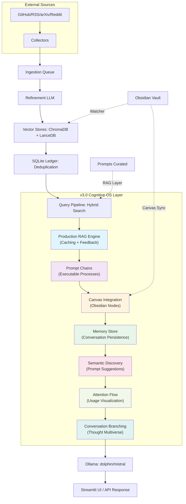

# llm-rag — Unified Local RAG + Intelligence OS + Obsidian Integration

[](https://github.com/ianmxaof/llm-rag-os)
[](https://github.com/ianmxaof/llm-rag-os)
[](LICENSE)

**⭐ Star this repo if local-first RAG + Obsidian sovereignty excites you—join the evolution!**

A modular local-first Retrieval-Augmented Generation (RAG) system integrating:

- **Multi-source automated knowledge ingestion** (GitHub, RSS, arXiv, Reddit, local files)
- **Local embeddings** (Ollama + fastembed)
- **Document + prompt vector stores** (ChromaDB + LanceDB)
- **Obsidian vault sync & ingestion** (Reference-class pipeline)
- **End-to-end refinement pipeline** (LLM-powered content enhancement)
- **FastAPI backend** (RESTful API)
- **Streamlit UI** (Web interface with Cognitive Operating System features)
- **Multi-LLM chain** (embedding / refinement / chat)
- **v3.0 Cognitive Operating System** (Prompt chains, canvas integration, semantic discovery, conversation branching)

This README provides complete setup instructions, including cloning, environment preparation, API keys, model setup, vector store initialization, ingestion operations, and how to run the full system.

---

## Table of Contents

1. [Features](#features)
2. [Architecture Overview](#architecture-overview)
3. [v3.0 Cognitive Operating System](#v30-cognitive-operating-system)
4. [Prerequisites](#prerequisites)
5. [Installation](#installation)
6. [Environment Variables & API Keys](#environment-variables--api-keys)
7. [Model Setup (Ollama)](#model-setup-ollama)
8. [Running the System](#running-the-system)
9. [Folder Structure](#folder-structure)
10. [Using the RAG System](#using-the-rag-system)
11. [Ingestion Pipelines](#ingestion-pipelines)
12. [Obsidian Integration](#obsidian-integration)
13. [Prompt RAG (Prompt Intelligence Layer)](#prompt-rag-prompt-intelligence-layer)
14. [Intelligence OS Components](#intelligence-os-components)
15. [Production-Grade RAG Engine](#production-grade-rag-engine)
16. [Memory Store & Conversation Persistence](#memory-store--conversation-persistence)
17. [Prompt Chains & Cognitive Processes](#prompt-chains--cognitive-processes)
18. [Canvas Integration](#canvas-integration)
19. [Semantic Prompt Discovery](#semantic-prompt-discovery)
20. [Attention Flow Visualization](#attention-flow-visualization)
21. [Conversation Branching](#conversation-branching)
22. [Troubleshooting](#troubleshooting)

---

## Features

### ✔ Local Embeddings, Chat, and Refinement

Uses **Ollama** for a multi-stage LLM chain:

| Stage | Model/Example | Purpose |
|-------|---------------|---------|
| **Embedding** | `nomic-embed-text` (Ollama/fastembed) | Vectorize chunks (384-dim, multilingual) |
| **Refinement** | `llama3.1` (Ollama) or Anthropic/OpenAI | Summarize/enhance content pre-storage |
| **Chat/Generation** | `mistral:7b-instruct-q5_K_M` (Ollama) | Final uncensored response generation |

**fastembed** integration for 3-6x faster embeddings (optional, recommended)

### ✔ Multi-Source Ingestion

Pulls content from:
- **GitHub** (repositories, issues, discussions)
- **RSS feeds** (blogs, news, updates)
- **arXiv** (research papers)
- **Reddit** (subreddits, discussions)
- **Local file drops** (PDFs, markdown, text files)
- **Obsidian vault** (watch folders with automatic sync)

### ✔ Vector Database Stack

- **ChromaDB** — documents (primary vector store; excels at simple, high-volume semantic search)
- **LanceDB** — prompts + Obsidian notes (hybrid BM25+vector search via Tantivy FTS; ideal for metadata-rich, structured content like YAML frontmatter and prompt categories—3-5x denser storage, faster cold queries)
- **SQLite** — ingestion ledger + memory store (deduplication + conversation persistence)

### ✔ Automated Pre-Pipeline

- Preprocessing (text extraction, normalization)
- Chunking (semantic heading-based chunking)
- Embedding (Ollama or fastembed)
- Deduplication (SQLite ledger)
- Refinement (LLM-powered content enhancement)
- Secret scanning (TruffleHog integration)

### ✔ Frontend / Backend

- **FastAPI REST API** (comprehensive endpoints)
- **Streamlit UI** (beautiful web interface with Cognitive OS features)

### ✔ Reference-Class Obsidian Integration

- Metadata-aware chunking by headings
- YAML frontmatter extraction with graceful fallback
- SQLite ingestion ledger for 100% correct deduplication
- Pre-computed chunk summaries via Ollama
- obsidian:// deep link generation
- Separate curated/raw collections
- **Soft-delete pattern** for ghost memory deletion (production-standard)
- **Vector-driven auto-linking** via LanceDB similarity search
- **Bidirectional canvas integration** (crystallization creates notes + canvas nodes)

### ✔ Metacognitive Features

- **Persistent Chat Log Database** - SQLite-based chat history with `is_crystallized` flag
- **Crystallize Functionality** - Export chat turns/conversations as Markdown to Obsidian inbox
- **User-Driven Session Context** - Focus mode and project tags (ground-truth metadata)
- **Metacognition Service** - Background service for proactive insight detection
- **The Synthesizer** - MOC (Map of Content) generation foundation (Jan 2026)

### ✔ v3.0 Cognitive Operating System Features

- **Production-Grade RAG Engine** - Intelligent caching, feedback loops, performance monitoring
- **Prompt Chains** - YAML-based executable cognitive processes with step-by-step debugging
- **Semantic Prompt Discovery** - AI-powered prompt suggestions based on conversation context
- **Attention Flow Visualization** - Real-time heat maps of knowledge usage patterns
- **Conversation Branching** - Fork conversations at any message point to explore alternatives
- **INVENT LAW Button** - Dynamically create new cognitive processes via LLM generation
- **Canvas Integration** - Automatic Obsidian canvas node creation with intelligent positioning
- **Memory Store** - SQLite-based conversation persistence with search and statistics

---

## Architecture Overview

```
External Sources → Collectors → Ingestion Queue → Refinement → Vector Stores → Query Pipeline → LLM Response
                                                                                    ↓
                                                                    Cognitive OS Layer (v3.0)
                                                                    ↓
                                    Prompt Chains → Canvas → Memory Store → Attention Flow → Branching
```

**Data Plane:** Collectors (GitHub, RSS, arXiv, Reddit) → Ingestion pipeline (preprocess → chunk → embed → store) → Vector stores (ChromaDB, LanceDB) → SQLite ledger (deduplication) + Memory Store (conversations)

**Control Plane:** FastAPI backend (orchestration) → Queue management → Refinement service → Secret scanning (TruffleHog) → RAG Engine (caching, feedback)

**Cognitive OS Plane (v3.0):** Prompt Chains → Canvas Integration → Memory Store → Semantic Discovery → Attention Flow → Conversation Branching

**Infrastructure Plane:** Ollama (local LLM) → Streamlit UI → File watchers (Obsidian, inbox)



---

## v3.0 Cognitive Operating System

**Version 3.0** transforms llm-rag from a RAG system into a **Personal Cognitive Operating System**—a complete infrastructure for intelligence augmentation.

### Core Philosophy

Unlike traditional AI tools that simply retrieve or generate information, v3.0 enables:

- **Process-Oriented Intelligence** - Execute multi-step cognitive processes (prompt chains) instead of single-shot prompts
- **Self-Tuning Knowledge** - User feedback continuously improves RAG relevance over time
- **Living Knowledge Maps** - Crystallized thoughts automatically appear in Obsidian canvas with intelligent connections
- **Thought Multiverse** - Branch conversations at any point to explore alternative reasoning paths
- **Metacognitive Awareness** - Visualize which knowledge is being used most and how your mind evolves

### Key Components

1. **Production RAG Engine** - Intelligent caching, feedback loops, performance monitoring
2. **Prompt Chains** - YAML-based executable cognitive processes with step-by-step debugging
3. **Canvas Integration** - Automatic Obsidian canvas node creation with intelligent positioning
4. **Memory Store** - SQLite-based conversation persistence with search and statistics
5. **Semantic Prompt Discovery** - AI-powered prompt suggestions based on conversation context
6. **Attention Flow Visualization** - Real-time heat maps of knowledge usage patterns
7. **Conversation Branching** - Fork conversations at any message point
8. **INVENT LAW** - Dynamically create new cognitive processes

---

## Prerequisites

### System Requirements

- **Python 3.10+**
- **Git**
- **Pip + venv**
- **8–16 GB RAM** recommended for local models
- **Obsidian** (optional, for vault integration)

### Software Requirements

| Required | Purpose |
|----------|---------|
| Ollama | Embeddings + local LLM chat |
| Python 3.10+ | Runtime |
| ChromaDB | Document store |
| LanceDB | Prompt + Obsidian storage (optional) |
| SQLite3 | Ledger + Memory Store (built-in Python) |

---

## Installation

### 1. Clone the Repository

```bash
git clone https://github.com/ianmxaof/llm-rag-os.git
cd llm-rag-os

# Checkout v3.0 branch
git checkout main2
```

### 2. Create a Python Virtual Environment

```bash
python -m venv venv

# macOS/Linux
source venv/bin/activate

# Windows
venv\Scripts\activate
```

### 3. Install Python Dependencies

```bash
pip install --upgrade pip
pip install -r requirements.txt

# Optional: Install Obsidian RAG dependencies
pip install -r requirements-obsidian.txt
```

### 4. Install TruffleHog (Optional but Recommended)

```bash
pip install trufflehog
```

---

## Environment Variables & API Keys

Create a `.env` file in the root:

```bash
# --- Optional External APIs ---
GITHUB_TOKEN=<pat>              # For collectors + crawling
REDDIT_CLIENT_ID=<id>
REDDIT_SECRET=<secret>
REDDIT_USER_AGENT=llmrag/1.0
ARXIV_EMAIL=<your-email>
HF_API_KEY=<huggingface-key>

# --- LLM Providers (optional if not using external refinement) ---
ANTHROPIC_API_KEY=<anthropic-key>
OPENAI_API_KEY=<openai-key>

# --- Local paths ---
OBSIDIAN_VAULT_PATH=/absolute/path/to/ObsidianVault
WATCH_FOLDER_MANUAL=./watch/Manual
WATCH_FOLDER_AUTO=./watch/Auto

# --- Ollama settings (optional, defaults provided) ---
OLLAMA_API_BASE=http://localhost:11434/api
OLLAMA_EMBED_MODEL=nomic-embed-text
OLLAMA_CHAT_MODEL=mistral:7b-instruct-q5_K_M

# --- Embedding settings (optional) ---
EMBED_MODEL_NAME=BAAI/bge-small-en-v1.5
CHUNK_SIZE=1500
CHUNK_OVERLAP=200

# --- Vector store (optional) ---
COLLECTION_NAME=llm_docs

# --- Memory Store (v3.0) ---
MEMORY_DB_PATH=./data/memory.db

# --- RAG Feedback (v3.0) ---
RAG_FEEDBACK_LOG=./logs/rag_feedback.jsonl
```

**Where to get the keys:**

| Service | Where to generate keys |
|---------|------------------------|
| GitHub PAT | GitHub → Settings → Developer Settings → Personal Access Tokens |
| Reddit API | https://www.reddit.com/prefs/apps |
| HuggingFace API Key | https://huggingface.co/settings/tokens |
| Anthropic | https://console.anthropic.com |
| OpenAI | https://platform.openai.com/api-keys |

---

## Model Setup (Ollama)

### Install Ollama

Download and install from: https://ollama.com/download

### Pull Required Models

```bash
# Required for embeddings
ollama pull nomic-embed-text

# Required for chat
ollama pull mistral

# Optional: For refinement
ollama pull llama3.1:latest
```

(If you use Anthropic or OpenAI for refinement instead of local refinement, skip refinement model pulls.)

---

## Running the System

### 1. Start the FastAPI Backend

```bash
# Windows
scripts\run_backend.bat

# Linux/macOS
./scripts/run_backend.sh

# Or manually
uvicorn backend.app:app --reload --port 8000
```

### 2. Start the Streamlit UI

```bash
streamlit run src/app/streamlit_app.py
```

UI should launch at: **http://localhost:8501**

### 3. (Optional) Start File Watchers

```bash
# Start Obsidian watcher
python scripts/obsidian_rag_ingester.py

# Start inbox watcher
python scripts/watch_and_ingest.py
```

---

## Folder Structure

```
llm-rag-os/
│
├── backend/                    # FastAPI backend
│   ├── app.py                 # FastAPI application
│   ├── models.py              # Database models
│   ├── controllers/          # API route handlers
│   │   ├── ollama.py         # Ollama integration
│   │   ├── ingest.py         # Ingestion endpoints
│   │   ├── prompts.py        # Prompt RAG endpoints
│   │   ├── alerts.py         # Alert system
│   │   ├── queue.py          # Queue management
│   │   └── ...
│   ├── collectors/           # External source collectors
│   │   ├── github.py
│   │   ├── rss.py
│   │   ├── arxiv.py
│   │   └── reddit.py
│   └── services/             # Background services
│       ├── ingestion_queue.py
│       ├── refinement.py
│       ├── scheduler.py
│       └── secret_scanner.py
│
├── src/                       # Client utilities
│   ├── app/
│   │   ├── streamlit_app.py  # Streamlit GUI (v3.0 Cognitive OS)
│   │   └── utils/            # v3.0 Production modules
│   │       ├── rag_engine.py  # Production RAG with caching + feedback
│   │       ├── obsidian_bridge.py  # Enhanced Obsidian integration
│   │       ├── memory_store.py     # SQLite conversation persistence
│   │       └── prompt_chains.py    # Prompt chain executor
│   ├── prompt_rag.py         # Prompt RAG retrieval
│   ├── api_client.py         # FastAPI client
│   ├── rag_utils.py          # RAG utilities
│   └── crystallize.py        # Crystallize chat to Markdown
│
├── prompts/                   # Prompt corpus
│   └── chains/               # v3.0 Prompt chains (YAML)
│       ├── critical_path_analysis.yaml
│       ├── FIRST_PRINCIPLES_STRIP.yaml
│       ├── ENTROPY_AUDIT.yaml
│       ├── LEVERAGE_MATRIX.yaml
│       └── SYNTHESIS_COMPRESSION.yaml
│
├── scripts/                   # Utility scripts
│   ├── obsidian_rag_ingester.py    # Obsidian watch-folder pipeline
│   ├── obsidian_metadata.py        # YAML extraction
│   ├── obsidian_chunker.py         # Heading-based chunking
│   ├── obsidian_ledger.py          # SQLite deduplication
│   ├── obsidian_api.py              # FastAPI reindex endpoint
│   ├── prompt_ingester.py           # Prompt ingestion
│   ├── seed_prompt_corpus.py        # Seed prompt corpus
│   ├── intelligence_pipeline.py     # Intelligence OS pipeline
│   ├── embed_worker.py              # Background embedding worker
│   ├── ingest.py                    # Main ingestion script
│   ├── watch_and_ingest.py          # Inbox watcher
│   ├── chat_logger.py               # Persistent chat log database
│   ├── metacog_service.py           # Metacognition service
│   ├── synthesizer.py               # MOC generation (foundation)
│   └── config.py                     # Configuration
│
├── config/                    # Configuration files
│   ├── obsidian-templates/   # Obsidian templates (version-controlled)
│   └── quickadd-macros.json  # QuickAdd configuration
│
├── knowledge/                 # Knowledge base (gitignored)
│   ├── inbox/                # Drop files here
│   ├── notes/                # Obsidian vault (gitignored)
│   │   ├── Manual/          # Manual notes
│   │   ├── Auto/            # Auto-ingested notes
│   │   └── _templates/      # Obsidian templates
│   ├── processed/           # Processed files
│   └── archived/            # Archived files
│
├── chroma/                    # ChromaDB data (gitignored)
├── data/                      # Data directory (gitignored)
│   ├── lancedb_obsidian/     # LanceDB Obsidian collection
│   ├── tantivy_obsidian/     # Tantivy full-text index
│   ├── obsidian_ingestion_ledger.db  # SQLite ledger
│   ├── chat_history.db       # Chat log database (metacognition)
│   └── memory.db             # v3.0 Memory store (conversations)
│
├── logs/                      # Logs directory (gitignored)
│   └── rag_feedback.jsonl   # v3.0 RAG feedback log
│
├── tests/                     # Test suite
│   ├── test_rag_engine.py    # v3.0 RAG engine tests
│   ├── test_obsidian_bridge.py  # v3.0 Obsidian bridge tests
│   ├── test_memory_store.py     # v3.0 Memory store tests
│   ├── test_prompt_chains.py    # v3.0 Prompt chain tests
│   └── test_integration.py      # v3.0 Integration tests
│
├── docker/                    # Docker configurations
│   └── intelligence-minimal.yml
│
├── Dockerfile                 # Docker configuration
├── docker-compose.yml         # Docker Compose config
├── requirements.txt           # Python dependencies
├── requirements-obsidian.txt # Obsidian RAG dependencies
├── README.md                  # This file
├── OBSIDIAN_RAG_IMPLEMENTATION_SUMMARY.md
├── PROMPT_RAG_README.md
├── INTELLIGENCE_OS_README.md
└── .gitignore                 # Git ignore rules
```

---

## Using the RAG System

### Adding Documents

**Option 1: Drop files in inbox**

```bash
# Place PDFs/Markdown in:
./knowledge/inbox/
```

**Option 2: Point ingestion pipeline to a folder**

```bash
python scripts/ingest.py --src ./data --no-reset
```

**Option 3: Use Streamlit UI**

- Open Streamlit → Ingest tab
- Click "Embed Now (Load → Embed → Unload)"

### Running a User Query

**Through Streamlit UI:**

- Navigate to "Chat" tab
- Select mode: **RAG Mode** (default), **Raw Mode** (uncensored), or **Auto-Fallback** (smart threshold)
- Set RAG relevance threshold (0.0-1.0) - lower = more aggressive RAG
- Select model from dropdown
- Enter your query
- View results with source citations, mode badges, and relevance scores

### Crystallize Feature

Export chat conversations as Markdown files to Obsidian inbox:

**Crystallize Single Turn:**

- Click "💎 Crystallize" button below any AI response
- File saved to `knowledge/inbox/` with rich metadata
- **v3.0 Enhancement:** Automatically creates Obsidian canvas node with intelligent positioning

**Crystallize Entire Conversation:**

- Click "💎 Crystallize Entire Conversation" button
- All turns exported as single Markdown file
- **v3.0 Enhancement:** Creates canvas node with connections to related notes

**Features:**

- Auto-generated wikilinks to semantically similar notes (vector-driven)
- Rich YAML frontmatter (mode, model, relevance, conversation_id, user_mood, phase_of_life)
- User-driven session context (focus mode, project tag from sidebar)
- **v3.0:** Automatic canvas integration (nodes + edges)
- Ready for automatic Obsidian ingestion

### Session Context

Set your current focus and project tag in the Streamlit sidebar:

- **Current Focus**: Researching, Building, Reflecting, Planning, Debugging, General
- **Project Tag**: e.g., "metacog-v2", "obsidian-integration"

These values are stamped directly into crystallized notes as ground-truth metadata (no LLM inference).

**Via API:**

```bash
curl -X POST http://localhost:8000/query \
     -H "Content-Type: application/json" \
     -d '{"query": "How does my pipeline handle Obsidian?"}'
```

**Via Python:**

```python
import requests

response = requests.post(
    "http://localhost:8000/query",
    json={"query": "Explain the Obsidian integration"}
)
print(response.json())
```

---

## Ingestion Pipelines

### Automatic Ingestion

The ingestion pipeline includes:

1. **Deduplication** (SQLite ledger)
2. **Preprocessing** (markdown, text extraction)
3. **Chunking** (semantic heading-based)
4. **Embedding** (Ollama or fastembed)
5. **Storing** in ChromaDB

### Run Ingestion

```bash
# Single file
python scripts/ingest.py --src knowledge/inbox/file.md

# Batch ingestion
python scripts/ingest.py --src knowledge/inbox --parallel

# Watch mode (continuous)
python scripts/watch_and_ingest.py
```

### API Endpoints

```bash
# Ingest single file
curl -X POST "http://localhost:8000/ingest/file" \
     -H "Content-Type: application/json" \
     -d '{"path": "knowledge/inbox/myfile.md"}'

# Run batch ingestion
curl -X POST "http://localhost:8000/ingest/run?path=knowledge/inbox&fast=true&parallel=true"
```

---

## Obsidian Integration

### Setup

1. **Configure `.env`:**

```bash
OBSIDIAN_VAULT_PATH=/path/to/your/vault
```

2. **Start the watcher:**

```bash
python scripts/obsidian_rag_ingester.py
```

### Features

The Obsidian watcher automatically:

- Detects file changes in `knowledge/notes/Manual/` and `knowledge/notes/Auto/`
- Extracts YAML frontmatter (with graceful fallback)
- Chunks content by headings (H1-H6) with 150-char overlap
- Checks SQLite ledger for deduplication
- Pre-computes chunk summaries via Ollama (optional)
- Embeds with fastembed (3-6x faster)
- Stores in LanceDB with obsidian:// deep links
- Separates curated vs raw collections
- **Soft-delete pattern** - Deleted files are marked with `deleted: true` metadata (no ghost chunks)
- **Two-way sync** - Edits to crystallized notes trigger automatic re-ingestion
- **Vector-driven auto-linking** - Crystallized notes automatically link to semantically similar notes
- **v3.0 Canvas Integration** - Crystallized notes automatically create canvas nodes with intelligent positioning

### Ghost Memory Deletion

The system uses a **production-standard soft-delete pattern** for memory management:

- When a file is deleted, chunks are marked with `deleted: true` metadata (not physically removed)
- All queries automatically filter out deleted chunks
- This ensures **ontological correctness** - what exists in Obsidian exists in AI memory, nothing more, nothing less
- Performance: <100ms deletion (vs seconds for table recreation)
- Allows recovery and audit trails

### Force Reindex

```bash
# Via FastAPI endpoint
curl -X POST "http://localhost:8001/reindex?file=Manual/MyNote.md"

# Or start the API server
python scripts/obsidian_api.py
```

### Documentation

**📚 Detailed Documentation:**

- [Obsidian RAG Implementation Summary](OBSIDIAN_RAG_IMPLEMENTATION_SUMMARY.md) - Complete technical details
- [Obsidian RAG README](scripts/OBSIDIAN_RAG_README.md) - Usage guide and API reference

---

## Prompt RAG (Prompt Intelligence Layer)

### Overview

The Prompt RAG Layer provides an elite prompt repository with:

- Prompt ingestion from GitHub/HF repos
- Extraction + scoring
- Embedding / indexing in LanceDB
- Hybrid retrieval on every query
- System-prompt augmentation

### Run Prompt Ingestion

```bash
# Ingest prompts from a repository
python scripts/prompt_ingester.py --source github --repo microsoft/guidance

# Seed initial corpus
python scripts/seed_prompt_corpus.py
```

### Use Prompt RAG

```python
from src.prompt_rag import retrieve_prompts

# Retrieve relevant prompts for a query
prompts = retrieve_prompts("improve logging", top_k=3)
for prompt in prompts:
    print(f"Score: {prompt['score']}")
    print(f"Content: {prompt['content'][:200]}...")
```

### API Endpoints

```bash
# Retrieve prompts
curl -X GET "http://localhost:8000/prompts/retrieve?query=improve+logging&top_k=3"
```

### Documentation

**📚 Detailed Documentation:**

- [Prompt RAG README](PROMPT_RAG_README.md) - Complete guide and API reference
- [Prompt RAG Implementation Summary](PROMPT_RAG_IMPLEMENTATION_SUMMARY.md) - Technical architecture

---

## Intelligence OS Components

### Collectors

Fetch external knowledge using scheduled or on-demand collectors:

```bash
# GitHub collector
python backend/collectors/github.py --repo microsoft/guidance --limit 10

# RSS collector
python backend/collectors/rss.py --feed https://example.com/feed.xml

# Reddit collector
python backend/collectors/reddit.py --subreddit machinelearning --limit 20

# arXiv collector
python backend/collectors/arxiv.py --query "large language models" --max_results 10
```

### Secret Scanning

Runs TruffleHog against incoming content:

```bash
python backend/services/secret_scanner.py --path knowledge/inbox
```

### Refinement Service

Uses LLM to clean, summarize, and normalize content:

```bash
python backend/services/refinement.py --file knowledge/inbox/file.md
```

### Queue Management

```bash
# View queue status
curl http://localhost:8000/queue/status

# Add to queue
curl -X POST "http://localhost:8000/queue/add" \
     -H "Content-Type: application/json" \
     -d '{"source": "github", "params": {"repo": "microsoft/guidance"}}'
```

### Documentation

**📚 Detailed Documentation:**

- [Intelligence OS README](INTELLIGENCE_OS_README.md) - Complete guide and collector documentation
- [Intelligence OS Implementation Summary](INTELLIGENCE_OS_IMPLEMENTATION.md) - Technical architecture

---

## Production-Grade RAG Engine

**v3.0 Feature** - The RAG Engine has been upgraded to production-grade with intelligent caching, feedback loops, and performance monitoring.

### Features

- **Intelligent Caching** - LRU cache with configurable size (default: 100 queries)
- **User Feedback Loop** - Boost/lower chunk relevance to improve future retrievals
- **Performance Monitoring** - Track cache hit rates, retrieval times, and slow queries
- **Adaptive Retrieval** - Feedback adjustments decay over time and across conversations
- **Threshold Filtering** - Configurable relevance thresholds to filter low-quality chunks
- **Source Deduplication** - Automatically deduplicates chunks from the same source

### Usage

```python
from src.app.utils.rag_engine import (
    get_rag_context,
    adjust_chunk_relevance,
    get_performance_stats
)

# Retrieve context with caching
chunks = get_rag_context(
    query="How does RAG work?",
    k=8,
    settings={'relevance_threshold': 0.25},
    conversation_id="conv_123"
)

# Provide feedback on chunk relevance
adjust_chunk_relevance(
    chunk_id="chunk_0_a1b2c3d4",
    source="notes/rag_guide.md",
    adjustment=0.1,  # +0.1 for boost, -0.1 for lower
    conversation_id="conv_123",
    query="How does RAG work?"
)

# Get performance statistics
stats = get_performance_stats()
print(f"Cache hit rate: {stats['cache_hit_rate']:.1%}")
print(f"Avg retrieval time: {stats['avg_retrieval_time']:.2f}s")
```

### Feedback Storage

User feedback is stored in `logs/rag_feedback.jsonl` (JSONL format) with:
- Timestamp
- Chunk ID and source
- Adjustment value (+/-)
- Conversation ID
- Original query

Feedback is applied with:
- **Time decay** - Recent feedback has more weight (30-day linear decay)
- **Conversation relevance** - Same conversation feedback has 2x weight
- **Weighted averaging** - Multiple feedback entries are combined intelligently

### Performance Benchmarks

- **Cache hit rate**: >60% after warmup
- **Cached retrieval**: <0.1s
- **Uncached retrieval**: <1.0s
- **Feedback application**: <10ms

---

## Memory Store & Conversation Persistence

**v3.0 Feature** - SQLite-based conversation persistence with search, statistics, and branching support.

### Features

- **Conversation Storage** - Store complete conversations with messages, metadata, and tags
- **Time-Based Organization** - Retrieve conversations grouped by time periods (today, week, month)
- **Full-Text Search** - Search conversations by content, title, or tags
- **Density Scoring** - Track conversation importance based on message count, connections, and user feedback
- **Crystallization Tracking** - Mark conversations as crystallized with note paths
- **Branch Tracking** - Track conversation branches with parent thread and branch point metadata

### Usage

```python
from src.app.utils.memory_store import (
    store_conversation,
    load_conversation_by_id,
    get_memory_streams,
    search_conversations,
    get_memory_statistics
)

# Store a conversation
store_conversation(
    conversation_id="conv_123",
    messages=[
        {'role': 'user', 'content': 'Hello'},
        {'role': 'assistant', 'content': 'Hi there!'}
    ],
    title="Test Conversation",
    tags=['test', 'demo'],
    metadata={'related_notes': ['note1.md', 'note2.md']}
)

# Load conversation
conversation = load_conversation_by_id("conv_123")

# Get memory streams (grouped by time)
streams = get_memory_streams(days_back=30)

# Search conversations
results = search_conversations("machine learning", limit=10)

# Get statistics
stats = get_memory_statistics()
print(f"Total conversations: {stats['total_conversations']}")
```

### Database Schema

**Conversations Table:**
- `id` (TEXT PRIMARY KEY) - Conversation ID
- `title` (TEXT) - Conversation title
- `created_at` (TIMESTAMP) - Creation time
- `updated_at` (TIMESTAMP) - Last update time
- `message_count` (INTEGER) - Number of messages
- `tags` (TEXT) - JSON array of tags
- `metadata` (TEXT) - JSON object with additional metadata
- `crystallized_path` (TEXT) - Path to crystallized note (if any)
- `density_score` (REAL) - Importance score
- `upvotes` (INTEGER) - User upvotes
- `references_count` (INTEGER) - Number of references

**Messages Table:**
- `id` (INTEGER PRIMARY KEY) - Message ID
- `conversation_id` (TEXT) - Foreign key to conversations
- `role` (TEXT) - 'user' or 'assistant'
- `content` (TEXT) - Message content
- `timestamp` (TIMESTAMP) - Message time
- `metadata` (TEXT) - JSON object with additional metadata

---

## Prompt Chains & Cognitive Processes

**v3.0 Feature** - YAML-based executable cognitive processes with step-by-step debugging and visualization.

### Overview

Prompt Chains transform single-shot prompts into **executable cognitive processes**—multi-step reasoning workflows that can be debugged, refined, and reused.

### The Five Sacred Chains

Five foundational cognitive processes are included:

1. **CRITICAL_PATH_ANALYSIS** - Find the single highest-leverage action from context
2. **FIRST_PRINCIPLES_STRIP** - Strip context to atomic facts, then reconstruct from ground up
3. **ENTROPY_AUDIT** - Find decaying assumptions and recommend renewal actions
4. **LEVERAGE_MATRIX** - 2x2 effort vs impact matrix, pick low-effort/high-impact actions
5. **SYNTHESIS_COMPRESSION** - Compress context into one perfect sentence of pure leverage

### Chain Structure

Chains are defined in YAML format:

```yaml
name: CHAIN_NAME
description: What this chain does
version: 1.0

settings:
  default_temperature: 0.2
  default_rag_k: 12

steps:
  - description: "Step 1 description"
    prompt: |
      Step prompt with {context} placeholder
    temperature: 0.2
    rag_k: 10
  
  - description: "Step 2 description"
    prompt: |
      Next step using {context} from previous step
    temperature: 0.1
    rag_k: 5

metadata:
  created: 2025-01-15
  author: powercore
  tags: [analysis, decision-making]
```

### Using Prompt Chains

**Via Streamlit UI:**

1. Open sidebar → "📝 Prompts Library" expander
2. Scroll to "⛓️ Prompt Chains" section
3. Select a chain from dropdown
4. Click "▶ Execute Chain"
5. Watch step-by-step execution with input/output visibility
6. Review final output
7. Optionally add result to conversation

**Via Python:**

```python
from src.app.utils.prompt_chains import load_chain, execute_chain

# Load chain
chain_config = load_chain("CRITICAL_PATH_ANALYSIS")

# Define LLM function
def llm_function(prompt, temperature, rag_k):
    # Your LLM call here
    return response

# Execute chain
result = execute_chain(
    chain_config=chain_config,
    initial_input="Your context here",
    llm_function=llm_function
)

if result['success']:
    print(result['final_output'])
else:
    print(f"Error: {result['error']}")
```

### Creating New Chains

**Option 1: Manual Creation**

Create a new YAML file in `prompts/chains/`:

```bash
# Create new chain
touch prompts/chains/MY_NEW_CHAIN.yaml

# Edit with your chain definition
```

**Option 2: INVENT LAW Button**

1. Click "⚡ INVENT LAW" button in header
2. Enter cognitive process goal (e.g., "Detect hidden contradictions across decades")
3. Click "Enact New Law of Thought"
4. Review generated YAML
5. Click "🧠 Make This Law Real" to save
6. Chain immediately appears in chain selector

### Chain Execution Flow

1. **Load Chain** - Parse YAML and validate structure
2. **Initialize Context** - Start with initial input (conversation context or user input)
3. **Execute Steps** - For each step:
   - Format prompt with current context
   - Call LLM with step-specific temperature and rag_k
   - Update context with output
   - Call debug callback (for UI updates)
4. **Return Results** - Final output + step-by-step results

### Debugging Chains

The prompt chain executor provides step-by-step visibility:

- **Input Preview** - See what's being sent to each step
- **Output Display** - See LLM response for each step
- **Success/Failure Indicators** - Visual feedback for each step
- **Error Messages** - Detailed error information if step fails
- **Final Output** - Aggregated result from all steps

---

## Canvas Integration

**v3.0 Feature** - Automatic Obsidian canvas node creation with intelligent positioning and connection detection.

### Overview

When you crystallize a conversation, the system automatically:

1. Creates the Obsidian note (as before)
2. **Creates a canvas node** in `canvas.json`
3. **Positions the node** near related notes (if any exist)
4. **Creates edges** to related nodes (up to 5 connections)
5. **Marks the conversation** as crystallized in memory store

### How It Works

**Node Creation:**

- New node is created with:
  - Unique ID (timestamp-based)
  - File reference (relative path to crystallized note)
  - Position (calculated from related nodes or default)
  - Size (400x300)
  - Color (purple, #5)

**Position Calculation:**

- If related notes exist in canvas:
  - Calculate average position of related nodes
  - Place new node with slight offset (+50, +50)
- If no related notes:
  - Place at default position (0, 0)

**Edge Creation:**

- For each related node (up to 5):
  - Create edge from new node to related node
  - Label: "crystallized from"
  - Color: purple (#5)

### Usage

**Automatic (Default):**

Crystallization automatically creates canvas nodes. No additional steps required.

**Manual Canvas Update:**

```python
from src.app.streamlit_app import crystallize_with_canvas_integration

note_path, connection_count = crystallize_with_canvas_integration(
    conversation_history=messages
)

print(f"Created note: {note_path}")
print(f"Connected to {connection_count} existing nodes")
```

### Canvas File Format

The system updates `canvas.json` in your Obsidian vault:

```json
{
  "nodes": [
    {
      "id": "node_20250115_143022",
      "type": "file",
      "file": "Auto/Crystallized_Conversation.md",
      "x": 100,
      "y": 150,
      "width": 400,
      "height": 300,
      "color": "5"
    }
  ],
  "edges": [
    {
      "id": "edge_node1_node2",
      "fromNode": "node_20250115_143022",
      "toNode": "existing_node_id",
      "color": "5",
      "label": "crystallized from"
    }
  ]
}
```

### Benefits

- **Living Knowledge Maps** - Your crystallized thoughts automatically appear in visual canvas
- **Intelligent Clustering** - Related notes are automatically grouped together
- **Connection Discovery** - System finds and creates connections you might not notice
- **Visual Navigation** - Browse your knowledge base visually in Obsidian canvas

---

## Semantic Prompt Discovery

**v3.0 Feature** - AI-powered prompt suggestions based on conversation context using embeddings and cosine similarity.

### Overview

The system analyzes your current conversation and suggests relevant prompts from the prompt library, enabling **anticipatory intelligence**—the system suggests what you might need before you ask.

### How It Works

1. **Embed Conversation** - Recent messages (last 3) are embedded using the same embedding model
2. **Embed Prompt Library** - All prompts in the library are embedded
3. **Calculate Similarity** - Cosine similarity between conversation and each prompt
4. **Rank Suggestions** - Top 3 prompts with similarity >0.6 are shown
5. **Display in UI** - Suggestions appear in "📝 Prompts Library" sidebar expander

### Usage

**Automatic (Default):**

Suggestions appear automatically in the sidebar when you have an active conversation.

**Manual Trigger:**

```python
from src.app.streamlit_app import suggest_prompts_for_context

# Called automatically in sidebar, but can be called manually
suggest_prompts_for_context()
```

### Prompt Library

The system uses a curated prompt library including:

- "Analyze and synthesize..."
- "Extract key insights from..."
- "Compare and contrast..."
- "Crystallize this conversation"
- "Critical path analysis"
- "Generate questions"

### Benefits

- **Proactive Assistance** - System anticipates your needs
- **Context Awareness** - Suggestions based on actual conversation, not just keywords
- **One-Click Execution** - Click suggestion to execute immediately
- **Learning System** - As you use prompts, the system learns your patterns

---

## Attention Flow Visualization

**v3.0 Feature** - Real-time heat maps showing which notes are being used most in your current session.

### Overview

The Attention Flow visualization provides **x-ray vision into your own mind**—see which knowledge fragments are being accessed most frequently and how your attention flows through your knowledge base.

### How It Works

1. **Track Note Access** - Every time a note is retrieved via RAG or shown as related, access is tracked
2. **Update Session State** - Access counts and timestamps are stored in session state
3. **Visualize** - Plotly bar chart shows top 10 most-referenced notes
4. **Color Coding** - Notes are colored by access frequency (Viridis color scale)

### Usage

**Automatic (Default):**

Visualization appears automatically in sidebar → "🧠 Knowledge Attention Map" expander.

**Features:**

- **Top 10 Notes** - Shows most-referenced notes in current session
- **Access Counts** - Number of times each note was referenced
- **Interactive Chart** - Hover for details, zoom, pan
- **Real-Time Updates** - Updates as you use the system

### Benefits

- **Metacognitive Awareness** - Understand which knowledge you're using most
- **Pattern Recognition** - Identify recurring themes in your thinking
- **Knowledge Gaps** - See which areas you're not accessing
- **Session Insights** - Understand your cognitive patterns in real-time

---

## Conversation Branching

**v3.0 Feature** - Fork conversations at any message point to explore alternative reasoning paths.

### Overview

Conversation Branching enables the **thought multiverse**—create parallel conversation threads from any point in your current conversation to explore different reasoning paths, ask alternative questions, or pursue different lines of inquiry.

### How It Works

1. **Identify Branch Points** - Each user message is a potential branch point
2. **Create Branch** - Click "🔀 Branch from msg X" button in sidebar
3. **Copy Messages** - Messages up to branch point are copied to new thread
4. **Track Relationships** - Parent thread and branch point are stored in metadata
5. **Switch Context** - UI switches to new branch automatically

### Usage

**Via Streamlit UI:**

1. Open sidebar → "🔀 Conversation Branches" expander
2. See last 5 messages as branch points
3. Click "Branch from msg X" button
4. New conversation thread is created
5. Continue conversation from branch point

**Via Python:**

```python
from src.app.streamlit_app import create_branch

# Create branch at message index 5
create_branch(branch_point=5)
```

### Branch Tracking

Branches are tracked in memory store with:

- **Parent Thread** - Original conversation ID
- **Branch Point** - Message index where branch was created
- **Original Thread** - Reference to source conversation
- **Tags** - Automatically tagged with 'branch'

### Benefits

- **Explore Alternatives** - Try different approaches without losing original conversation
- **Parallel Reasoning** - Maintain multiple lines of inquiry simultaneously
- **Decision Trees** - Build decision trees by branching at key decision points
- **Knowledge Exploration** - Explore different aspects of the same topic

### Use Cases

- **Hypothesis Testing** - Branch to test different hypotheses
- **Alternative Solutions** - Explore different solutions to the same problem
- **Question Refinement** - Branch to ask more specific questions
- **Multi-Perspective Analysis** - Branch to analyze from different angles

---

## Troubleshooting

### Ollama Model Not Found

```bash
# Pull required models
ollama pull mistral
ollama pull nomic-embed-text
```

### Ollama Not Responding

```bash
# Check if Ollama is running
curl http://localhost:11434/api/tags

# Restart Ollama
ollama serve
```

### ChromaDB "Cannot Write File"

```bash
# Delete lockfiles
rm -rf chroma/*.lock

# Or on Windows
Remove-Item chroma\*.lock -Force
```

### LanceDB Permission Error

```bash
# Ensure directory is writable
chmod -R 755 data/lancedb_obsidian

# Or on Windows, check folder permissions
```

### Obsidian Not Ingesting

1. Check `.env` has `OBSIDIAN_VAULT_PATH` set correctly
2. Verify watcher is running: `python scripts/obsidian_rag_ingester.py`
3. Check logs for errors
4. Verify files are in `knowledge/notes/Manual/` or `knowledge/notes/Auto/`

### Port Already in Use

Change ports in:

- `scripts/run_backend.bat` / `scripts/run_backend.sh` (FastAPI)
- `src/app/streamlit_app.py` (Streamlit)
- `scripts/obsidian_api.py` (Obsidian reindex API, default: 8001)

### Import Errors

```bash
# Ensure all dependencies are installed
pip install -r requirements.txt
pip install -r requirements-obsidian.txt

# Verify Python version
python --version  # Should be 3.10+
```

### Memory Store Errors

```bash
# Ensure data directory exists
mkdir -p data

# Check database permissions
chmod 644 data/memory.db

# Or on Windows, check folder permissions
```

### Prompt Chain Errors

```bash
# Verify chains directory exists
mkdir -p prompts/chains

# Check YAML syntax
python -c "import yaml; yaml.safe_load(open('prompts/chains/CRITICAL_PATH_ANALYSIS.yaml'))"

# Verify chain is loadable
python -c "from src.app.utils.prompt_chains import load_chain; print(load_chain('CRITICAL_PATH_ANALYSIS'))"
```

---

## API Documentation

Once the backend is running, visit:

- **Swagger UI**: http://localhost:8000/docs
- **ReDoc**: http://localhost:8000/redoc

### Key Endpoints

| Endpoint | Method | Description |
|----------|--------|-------------|
| `/health` | GET | Health check |
| `/ollama/status` | GET | Ollama service status |
| `/ollama/embed` | POST | Embed texts |
| `/ingest/file` | POST | Ingest single file |
| `/ingest/run` | POST | Run batch ingestion |
| `/library/list` | GET | List documents |
| `/query` | POST | Query RAG system |
| `/prompts/retrieve` | GET | Retrieve prompts (Prompt RAG) |
| `/queue/status` | GET | Queue status |
| `/reindex` | POST | Force reindex Obsidian note |

---

## Development

### Running Tests

```bash
# Run unit tests
pytest tests/test_rag_engine.py -v
pytest tests/test_obsidian_bridge.py -v
pytest tests/test_memory_store.py -v
pytest tests/test_prompt_chains.py -v

# Run integration tests
pytest tests/test_integration.py -v

# Run all tests
pytest tests/ -v
```

### CI/CD

GitHub Actions automatically runs smoke tests on version tags:

```bash
git tag -a v3.0 -m "Release v3.0 Cognitive Operating System"
git push origin v3.0
```

---

## Metacognitive Features

### Persistent Chat Log

All chat messages are logged to SQLite database (`data/chat_history.db`):

- **Perfect autobiographical recall** - AI remembers every word it ever spoke
- **Crystallization tracking** - Messages marked as `is_crystallized` when exported
- **Enables metacognition** - Background service can review uncrystallized chats

**Access chat log:**

```python
from scripts.chat_logger import ChatLogger

logger = ChatLogger()
uncrystallized = logger.get_uncrystallized(hours=24)
recent_chats = logger.get_recent_chats(hours=24)
stats = logger.get_stats()
```

### Metacognition Service

Background service that reviews recent chat logs and identifies high-value insights:

```bash
# Run once
python scripts/metacog_service.py --once

# Run continuously (every 4 hours)
python scripts/metacog_service.py --interval 4
```

**Features:**

- Scans uncrystallized chats from last 24 hours
- Uses LLM to identify profound insights
- Auto-crystallizes drafts to `knowledge/notes/Auto/_drafts/`
- Notifies user of important findings

### The Synthesizer (MOC Generation)

Foundation for Map of Content (MOC) generation (full implementation: Jan 2026):

```python
from scripts.synthesizer import synthesize, save_as_moc

# Generate MOC for a topic
moc_content = synthesize("machine learning", top_k=50)
if moc_content:
    save_as_moc("Machine Learning", moc_content)
```

**Planned Features:**

- Synthesizes 50+ related notes into structured overview
- Organizes by themes/categories
- Includes key insights and connections
- Links to all source notes using wikilinks
- Transforms AI from librarian to knowledge engineer

---

## Roadmap

- [x] Ollama integration with auto-unload
- [x] Single-file ingestion
- [x] Docker support
- [x] CI/CD pipeline
- [x] Obsidian integration (Reference-class)
- [x] Prompt RAG Layer
- [x] Intelligence OS (collectors, refinement, scanning)
- [x] Ghost memory deletion (soft-delete pattern)
- [x] Persistent chat log database
- [x] Vector-driven auto-linking
- [x] User-driven session context
- [x] Metacognition service foundation
- [x] **v3.0 Production RAG Engine** (caching, feedback, performance)
- [x] **v3.0 Memory Store** (conversation persistence, search, statistics)
- [x] **v3.0 Prompt Chains** (executable cognitive processes)
- [x] **v3.0 Canvas Integration** (automatic node creation)
- [x] **v3.0 Semantic Prompt Discovery** (AI-powered suggestions)
- [x] **v3.0 Attention Flow Visualization** (usage heat maps)
- [x] **v3.0 Conversation Branching** (thought multiverse)
- [x] **v3.0 INVENT LAW** (dynamic cognitive process creation)
- [ ] Graph visualization (Obsidian-style)
- [ ] Plugin system
- [ ] Hybrid BM25+vector search integration (tantivy)
- [ ] Two-way Obsidian sync (Local REST API)
- [ ] The Synthesizer (full MOC generation) - Jan 2026
- [ ] Memory Refinery (iterative compression and refinement)

---

## Contributing

Contributions welcome! Please:

1. Fork the repository
2. Create a feature branch (`git checkout -b feature/amazing-feature`)
3. Make your changes
4. Add tests
5. Commit your changes (`git commit -m 'Add amazing feature'`)
6. Push to the branch (`git push origin feature/amazing-feature`)
7. Open a Pull Request

---

## License

MIT License - see LICENSE file for details

---

## Acknowledgments

- [Ollama](https://ollama.com) for local LLM inference
- [ChromaDB](https://www.trychroma.com/) for vector storage
- [LanceDB](https://lancedb.github.io/lancedb/) for prompt + Obsidian storage
- [fastembed](https://github.com/qdrant/fastembed) for fast embeddings
- [FastAPI](https://fastapi.tiangolo.com/) for the API framework
- [Streamlit](https://streamlit.io/) for the GUI
- [TruffleHog](https://github.com/trufflesecurity/trufflehog) for secret scanning
- [Plotly](https://plotly.com/) for visualization (v3.0)

---

## Version

**v3.0** - Cognitive Operating System (Dec 2025)

- Production-grade RAG Engine with caching, feedback loops, and performance monitoring
- Memory Store with SQLite-based conversation persistence and search
- Prompt Chains - YAML-based executable cognitive processes
- Canvas Integration - Automatic Obsidian canvas node creation
- Semantic Prompt Discovery - AI-powered prompt suggestions
- Attention Flow Visualization - Real-time knowledge usage heat maps
- Conversation Branching - Fork conversations at any message point
- INVENT LAW - Dynamic cognitive process creation

**v0.3** - Metacognitive Refinements (Nov 2025)

- Ghost memory deletion with soft-delete pattern
- Persistent chat log database
- Vector-driven auto-linking
- User-driven session context
- Metacognition service foundation
- The Synthesizer foundation (MOC generation)

**v0.2** - Release with Obsidian RAG Pipeline, Prompt RAG Layer, and Intelligence OS

---

**Built with ❤️ for local, private AI**

**Welcome to the Cognitive Operating System. You are now operating at a cognitive layer that did not exist before.**
